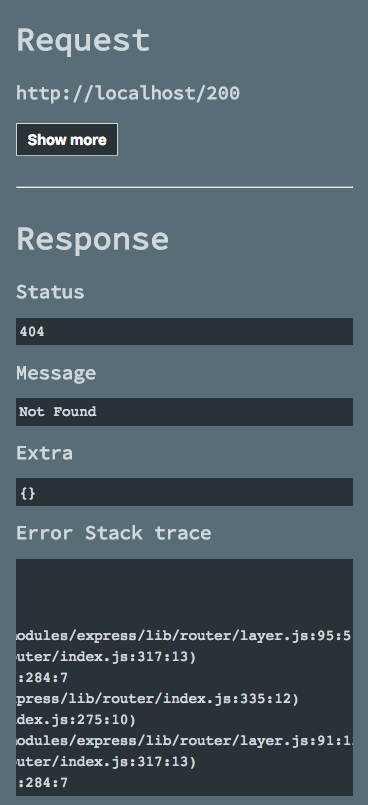

# express-errorhandlers 🚀

[](https://github.com/cam-inc/express-errorhandlers/blob/develop/LICENSE)
[](https://github.com/cam-inc/express-errorhandlers/blob/develop/LICENSE)
[](https://github.com/cam-inc/express-errorhandlers/blob/develop/LICENSE)


[](https://nodei.co/npm/express-errorhandlers/)

Error handler for [expressjs](http://expressjs.com/)(TypeScript)

## Install

It is registered in the [npm repository - express-errorhandlers](https://www.npmjs.com/package/express-errorhandlers). Please install from the npm command.

```sh
npm install --save express-errorhandlers
```

## Demo Server

```sh
git clone git@github.com:cam-inc/express-errorhandlers.git
cd express-errorhandlers
npm install
npm start # access url : http://localhost:3000/
```

## Screenshot

### Access Brower(html)



### Access curl(json)

```sh
$ curl -v -H 'Accept:application/json' "http://localhost:3000/500?foo=1" | jq .
  % Total    % Received % Xferd  Average Speed   Time    Time     Time  Current
                                 Dload  Upload   Total   Spent    Left  Speed
  0     0    0     0    0     0      0      0 --:--:-- --:--:-- --:--:--     0*   Trying ::1...
* TCP_NODELAY set
* Connected to localhost (::1) port 3000 (#0)
> GET /500?foo=1 HTTP/1.1
> Host: localhost:3000
> User-Agent: curl/7.54.0
> Accept:application/json

< HTTP/1.1 500 Internal Server Error
< X-Powered-By: Express
< Content-Type: application/json; charset=utf-8
< Content-Length: 1758
< ETag: W/"6de-25i+IrzWztUq0cBgAq/eBD39P50"
< Date: Tue, 06 Mar 2018 09:57:02 GMT
< Connection: keep-alive

{ [1758 bytes data]
100  1758  100  1758    0     0   183k      0 --:--:-- --:--:-- --:--:--  190k
* Connection #0 to host localhost left intact
{
  "response": {
    "status": 500,
    "message": "Server Error",
    "extra": {},
    "stack": "Error: /500 Server Error!!\n    at app.get (/Users/fkei/express-errorhandlers/demo.js:41:8)\n    at Layer.handle [as handle_request] (/Users/fkei/express-errorhandlers/node_modules/express/lib/router/layer.js:95:5)\n    at next (/Users/fkei/express-errorhandlers/node_modules/express/lib/router/route.js:137:13)\n    at Route.dispatch (/Users/fkei/express-errorhandlers/node_modules/express/lib/router/route.js:112:3)\n    at Layer.handle [as handle_request] (/Users/fkei/express-errorhandlers/node_modules/express/lib/router/layer.js:95:5)\n    at /Users/fkei/express-errorhandlers/node_modules/express/lib/router/index.js:281:22\n    at Function.process_params (/Users/fkei/express-errorhandlers/node_modules/express/lib/router/index.js:335:12)\n    at next (/Users/fkei/express-errorhandlers/node_modules/express/lib/router/index.js:275:10)\n    at urlencodedParser (/Users/fkei/express-errorhandlers/node_modules/body-parser/lib/types/urlencoded.js:91:7)\n    at Layer.handle [as handle_request] (/Users/fkei/express-errorhandlers/node_modules/express/lib/router/layer.js:95:5)",
    "extraDebug": {}
  },
  "request": {
    "accessurl": "http://localhost:3000/500?foo=1",
    "headers": {
      "host": "localhost:3000",
      "user-agent": "curl/7.54.0",
      "accept": "application/json"
    },
    "hostname": "localhost",
    "ip": "::1",
    "ips": [],
    "originalUrl": "/500?foo=1",
    "url": "/500?foo=1",
    "path": "/500",
    "httpVersion": "1.1",
    "method": "GET",
    "protocol": "http",
    "params": {},
    "query": {
      "foo": "1"
    }
  }
}
```

### Access curl(text)

```sh
$ curl -v -H 'Accept:text/plain' "http://localhost:3000/500?foo=1"
*   Trying ::1...
* TCP_NODELAY set
* Connected to localhost (::1) port 3000 (#0)
> GET /500?foo=1 HTTP/1.1
> Host: localhost:3000
> User-Agent: curl/7.54.0
> Accept:text/plain

< HTTP/1.1 500 Internal Server Error
< X-Powered-By: Express
< Content-Type: text/plain; charset=utf-8
< Date: Tue, 06 Mar 2018 09:59:19 GMT
< Connection: keep-alive
< Transfer-Encoding: chunked
<
>>>> Request

Access Url : http://localhost:3000/500?foo=1
Headers : {
  &quot;host&quot;: &quot;localhost:3000&quot;,
  &quot;user-agent&quot;: &quot;curl/7.54.0&quot;,
  &quot;accept&quot;: &quot;text/plain&quot;
}
Host name : localhost
IP : ::1
IPs :
Original URL : /500?foo=1
URL : /500?foo=1
Path : /500
HTTP Version : 1.1
HTTP Method : GET
HTTP Protocol : http
HTTP Params : {}
HTTP Querys : {
  &quot;foo&quot;: &quot;1&quot;
}
<<<< Response

Status : 500
Message : Server Error
Extra : {}Error Stack trace : Error: /500 Server Error!!
    at app.get (/Users/fkei/express-errorhandlers/demo.js:41:8)
    at Layer.handle [as handle_request] (/Users/fkei/express-errorhandlers/node_modules/express/lib/router/layer.js:95:5)
    at next (/Users/fkei/express-errorhandlers/node_modules/express/lib/router/route.js:137:13)
    at Route.dispatch (/Users/fkei/express-errorhandlers/node_modules/express/lib/router/route.js:112:3)
    at Layer.handle [as handle_request] (/Users/fkei/express-errorhandlers/node_modules/express/lib/router/layer.js:95:5)
    at /Users/fkei/express-errorhandlers/node_modules/express/lib/router/index.js:281:22
    at Function.process_params (/Users/fkei/express-errorhandlers/node_modules/express/lib/router/index.js:335:12)
    at next (/Users/fkei/express-errorhandlers/node_modules/express/lib/router/index.js:275:10)
    at urlencodedParser (/Users/fkei/express-errorhandlers/node_modules/body-parser/lib/types/urlencoded.js:91:7)
    at Layer.handle [as handle_request] (/Users/fkei/express-errorhandlers/node_modules/express/lib/router/layer.js:95:5)
* Connection #0 to host localhost left intact
Error Extra debug : {}`
```

## API

```js
const expressErrorhandlers = require('express-errorhandlers');
```

### Handler

Handler containing error class.

```js
const Handler = expressErrorhandlers.Handler;

const err = new Error('Error!!');
const handler = new Handler(err, 500, 'Internal Server Error', {serviceErrorCode: 'A-500-000001'}, {userId: 'fkei'})
```

#### Handler constructor

-   Type : `(Error: error, Int: status, String: message, Object: extra, Object extraDebug)`

#### Handler properties

-   **error**
    -   Type: `Error`
    -   Description: Detected error instance.
    -   Default: `new Error();`
    -   Required: no
-   **status**
    -   Type: `Int`
    -   Description: HTTP Response status code.
    -   Default: `500`
    -   Required: no
-   **message**
    -   Type: `String`
    -   Description: Error message.
    -   Default: `Server Error`
    -   Required: no
-   **extra**
    -   Type: `Object`
    -   Description: It is a data area that you can freely use. It is also used in production environments.
    -   Default: `{}`
    -   Required: no
-   **extraDebug**
    -   Type: `Object`
    -   Description: It is a data area that you can freely use. Ignored in production environment.
    -   Default: `{}`
    -   Required: no

## Types of Middleware

### Skip OK Handler

We will return the unnecessary request such as `favicon.ico` etc. with 200 OK.
Used with API Server etc.

Register to [expressjs](http://expressjs.com/) middleware. It is desirable after router.

```js
app.use(expressHandlers.middleware.skipOkHandler(
  paths: ['/favicon.ico', '/robots.txt', 'sitemap.xml'], // Set to skip trailing. (optional)
  fn: (err, req, res, next) => { // It is possible to overwrite HTTP Response processing. (optional)
    res.status(200).end();
  };
));
```

> It can be used alone.

### Not Found

`404 Not Found` process is done simply.

Register to [expressjs](http://expressjs.com/) middleware. It is desirable after router.

```js
app.use(expressHandlers.middleware.notFound(
  message : 'Not Found', // custom response message (optional)
  extra : {...}, // It is a data area that you can freely use. It is also used in production environments. (optional)
  extraDebug: {...}, //It is a data area that you can freely use. Ignored in production environment. (optional)
));
```

> `Not Found` depends on `Error Handler` middleware.

### Error Handler

Implement common error handler using "express next(error)".

-   Response data supports `Content-Type` of `json, html, plain` separately for HTTP Header `Accept`.
-   It is possible to change the output format by `development` and `production`.
-   HTML and TEXT output can use template engine(only pug).
-   For custom processing such as log output, any processing can be executed after all processing is finished. **(options: final)**

#### Register

Register to [expressjs](http://expressjs.com/) middleware. It is desirable after router.

```js
app.use(expressHandlers.middleware.errorHandler({
  debug: process.env.NODE_ENV !== 'production', //  (optional)
  templateHTML: path.join(__dirname + 'xxx.pug') or 'template string', // pug template string or pug file path (text/html) (optional)
  templateHTMLOptions: { debug: true }, // pug compile config (text/html) (optional)
  templateTEXT: {...}, // pug template string or pug file path (text/plain) (optional)
  templateTEXTOptions: {...}, // pug compile config (text/plain) (optional)
  status: 500, // default response status code (optional)
  message: 'Internal Server Error' // default error message (optional)
  extra: {...}, // It is a data area that you can freely use. It is also used in production environments. (optional)
  extraDebug: {...}, //It is a data area that you can freely use. Ignored in production environment. (optional)
  final: (req, res, handler) => { // Postprocessing function. (optional)
    console.error('final. error:', handler); // log output
  }
}));
```

##### debug off (production)

If debugging is off, only the following data will be returned.

```js
{
  response: {
    status: data.status,
    message: data.message,
    extra: data.extra,
  }
};
```

## Changelog

Detailed changes for each release are documented in the [release notes](https://github.com/cam-inc/express-errorhandlers/releases).

## Copyright

CA Mobile, Inc. All rights reserved.

## LICENSE

MIT LICENSE [LICENSE](LICENSE)
